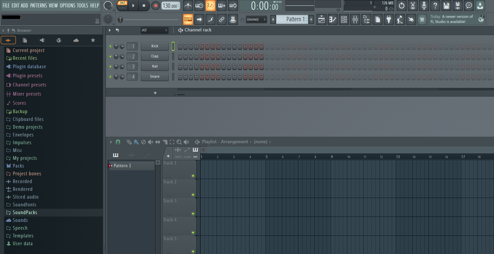
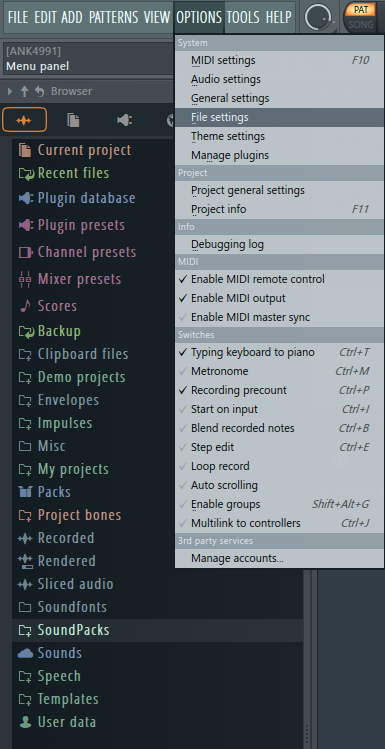
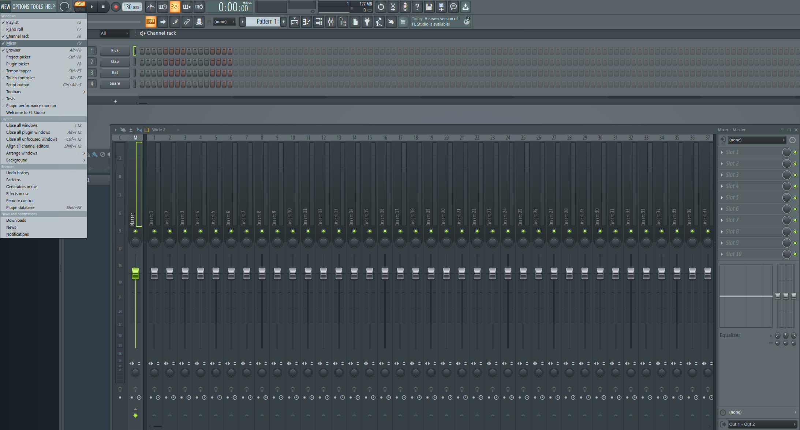
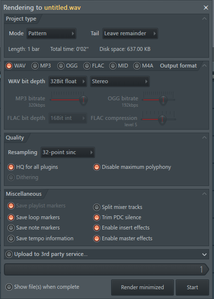

# FL Studio Startup Guide

## Overview
**FL Studio** is a **Digital Audio Workstation** or **DAW** that allows you to produce, mix, master, and record music.  
This guide will go through the basics of the layout and important sections.

## Layout
When you first open FL Studio, you will see a layout that looks something like this.  

### Browser
On the left, you will see the **Browser**. This section serves as your file directory, where you can drag and drop audio files into your project.  
To add a new folder, you can navigate to **Options/File Settings** and add a new path, selecting the folder where you keep your audio files.  

### Playlist
On the bottom right of the page is the **Playlist**, which holds all of the clips used in your project, which can be arranged as needed.  
You can also trim and mute clips, as well as move them into different tracks.

### Channel Rack
At the top is the **Channel Rack**, which is used to build **Patterns**. These are presets that you can reuse in your music.  
For example, if you have a drum loop that repeats a certain number of times, you can easily do this by creating a pattern, dragging in each sound to its respective section.  
You can add as many sounds to a pattern as you want, including drums and other audio samples.

### Mixer
Another important part of working with FL Studio is the **Mixer**.  
This section can be accessed by going to **View/Mixer**.  
Here, you can mix your music and add any desired effects in each track, which holds one sound.  
This is where you will add things like EQ, Reverb, and others.  
It is also used for recording, and you can set up an input microphone easily using an audio interface like a **Scarlett 2i2**.  

## Exporting
When you are finished with a song, you can **export** it easily by going to **File/Export/Wave File**.  
You can select your export file type, bitrate, and various other options in this section.  
**Note:** If exporting a finished product, make sure that **Split mixer tracks** is off and **Enable master effects** is on.  
After processing, the audio file will be saved in the directory that you choose.  

## Conclusion
In this guide, we learned the basics of FL Studio's layout, gaining an understanding of how to utilize it effectively for making music.  
Knowing this, you will be able to start making songs, gaining familiarity as you go along.