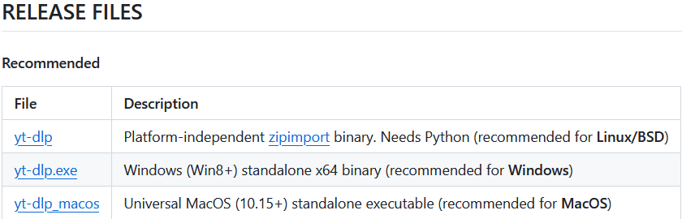
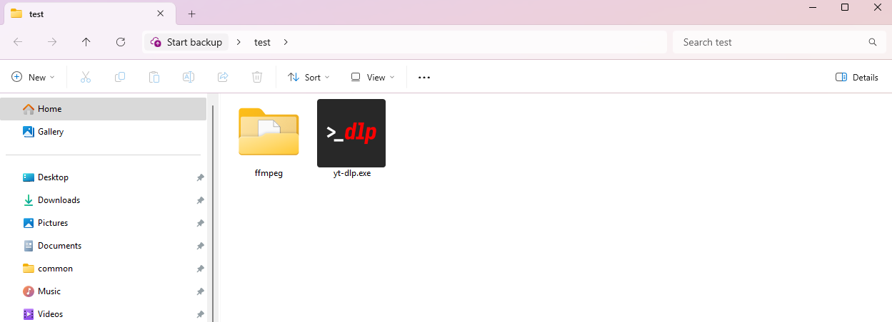
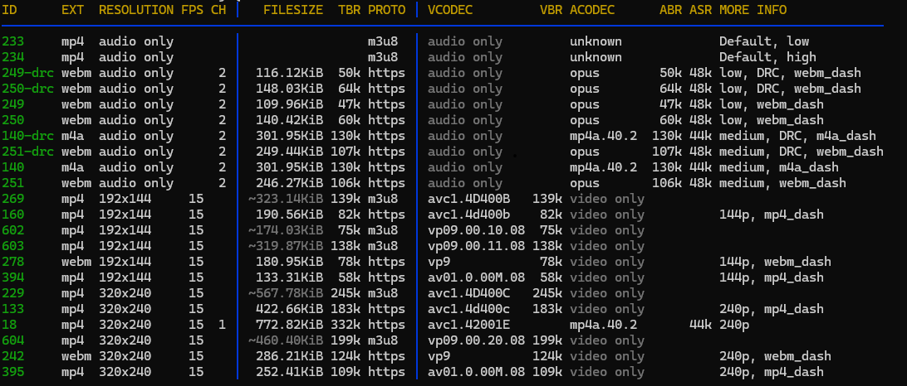

# How to Install and Use yt-dlp (Windows)

## Introduction
**yt-dlp** is a command-line audio/video downloader that works for various websites.  
This guide will walk you through how to install the tool, as well as **ffmpeg**, which is needed for thumbnail functionality.    
**Note**: This tool should not be used on YouTube, and any videos downloaded should not be copyrighted.

---

## Installing yt-dlp
1. To begin, you should head to the GitHub repo, located at https://github.com/yt-dlp/yt-dlp.  
2. From there, scroll down to the README section and click on **Download**.
3. Select the **yt-dlp.exe** option for Windows.

  

4. This will download an exe file, which you can place into a folder of your choosing.

## Installing ffmpeg
While not strictly necessary, ffmpeg is very useful in combination with yt-dlp, allowing you to download thumbnails with videos.
1. To install, go to https://ffmpeg.org and click the green **Download** button.
2. After installing, you will have a folder called **ffmpeg**, which should be placed in the same directory as **yt-dlp.exe**.
3. When both installations are complete, you should have a folder that looks like this.  

  

## Using yt-dlp
Now that everything is installed, we can move forward with actually using yt-dlp to download videos.  
1. First, open the command prompt by typing **`cmd`** into the Windows search bar and hitting enter.
2. With the window open, navigate to the directory where you saved your files by using the **`cd`** command.  

For example, if you saved your folder on your Desktop, and the command prompt starts off at **`C:\Users\yourUser`**, you could do **`cd/Desktop/yourFolder`**, or **`cd/Desktop/OneDrive/yourFolder`**, depending on how your Windows is set up.  

To check what is in the current directory, you can use the **`dir`** command.   

3. Once you have gone to the path of your folder, you are ready to start downloading.

## Commands and Formatting
There are a variety of commands that are used when downloading videos, and they differ slightly based on if you are downloading a single video, or a playlist.  

The general process for downloading a video with yt-dlp is as follows:
1. Check what quality values are available for the video.
2. Download the video, either at best quality or at the quality of your choosing.
3. Combine that with the best audio available.
4. Merge the two together.
5. Embed the thumbnail.
6. Add in the link of the video, as well as default commands for yt-dlp and ffmpeg.

Although this may seem long, the command to do all of these things is actually pretty straight forward.  
To find the quality of a video, type **`yt-dlp -F yourlink`** and hit **Enter**, replacing **`yourlink`** with a link of your choosing.  
After some processing, you should see a screen that looks like this.

  

- The most important thing to look for is the ID value on the left, which is what you will be using in your commands.  
- For this example video, we see that **395** is the highest quality video available.
- Combining everything together, we can use the following command to download the video:  
**`yt-dlp -f 395+bestaudio --merge-output-format mp4 --embed-thumbnail yourlink --ffmpeg-location %CD%\ffmpeg\bin`**
- Here, we are using the base command **`yt-dlp`**, using **`-f`** to denote quality choice, picking **`395+bestaudio`** as our quality, choosing the output format to be mp4 with **`-merge-output-format mp4`**, making sure we get the thumbnail with **`--embed-thumbnail`**, providing the link of the video (**`yourlink`**), and finally giving yt-dlp the location of ffmpeg with **`--ffmpeg-location %CD%\ffmpeg\bin`**

This general format can be used for any video you download. For playlists, however, the format is slightly different.  

### Downloading a Playlist
To download a playlist, you will want to make sure it is accessable without a login, as well as check the quality of each video to make sure there are no issues.

If the playlist contains videos with different quality values, you will have to split up the commands per quality.

For example, if we were to download a playlist full of videos with the quality from before, 395, the command would look something like this.  
**`yt-dlp -f 395+bestaudio --merge-output-format mp4 --playlist-items 1-10 --embed-thumbnail -o "%(playlist_index)s-%(title)s.%(ext)s" yourlink --ffmpeg-location %CD%\ffmpeg\bin`**

- While similar to the command from before, there are a couple of noticeable additions.
- **`--playlist-items 1-10`** is telling yt-dlp to download videos numbered 1-10 in the playlist. You can modify this to be any value, and also download specific numbered videos by using  
**`--playlist-items 1,2,3`**.
- **`-o "%(playlist_index)s-%(title)s.%(ext)s"`** is a command that lets you name the videos according to a custom format, which is useful when you want to number numbers in a playlist manually.  
An example file downloaded with this formatting would look like **1-Title.mp4**.
- For videos of other qualities, you would just replace the **`395`** in the command with whichever ID is available for that video.

### Quality Cheat Sheet
Below are some common quality values that come up in videos, and their respective yt-dlp ID numbers.  
There are many more that exist, but knowing these can speed up the process of downloading, as you will know which ID to put without having to use the **`-F`** command every time.

| Quality    | yt-dlp ID|
|------------|----------|
| 360p       | 243      |
| 480p       | 244      |
| 720p       | 247      |
| 720p60     | 302      |
| 1080p      | 248      |

## Conclusion
In this guide, you have learned how to install yt-dlp and ffmpeg, set them up, and download a video and a playlist.  
From here, you can tinker with the commands and modify them to your needs.  

**Tip**: Keeping a list of past commands is a useful way to remember their functionality.